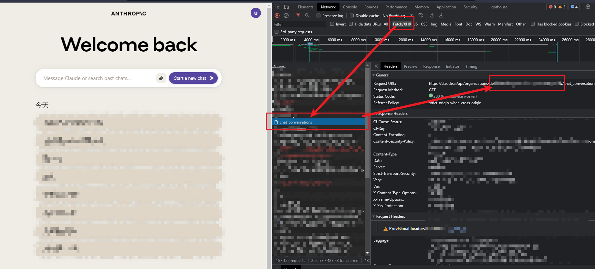
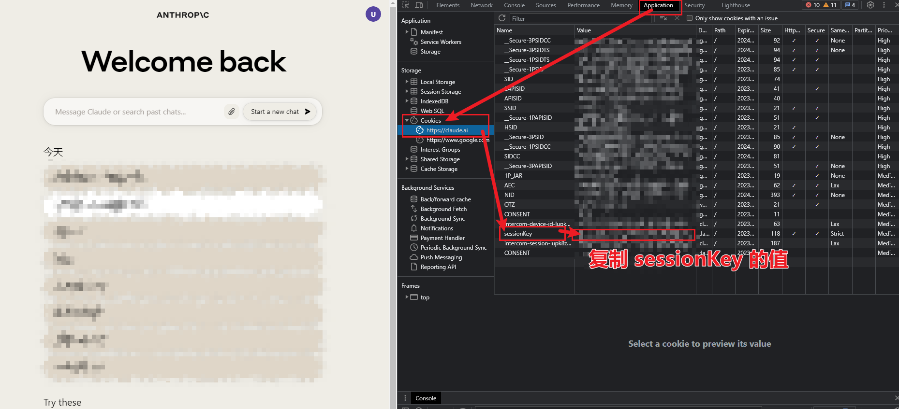
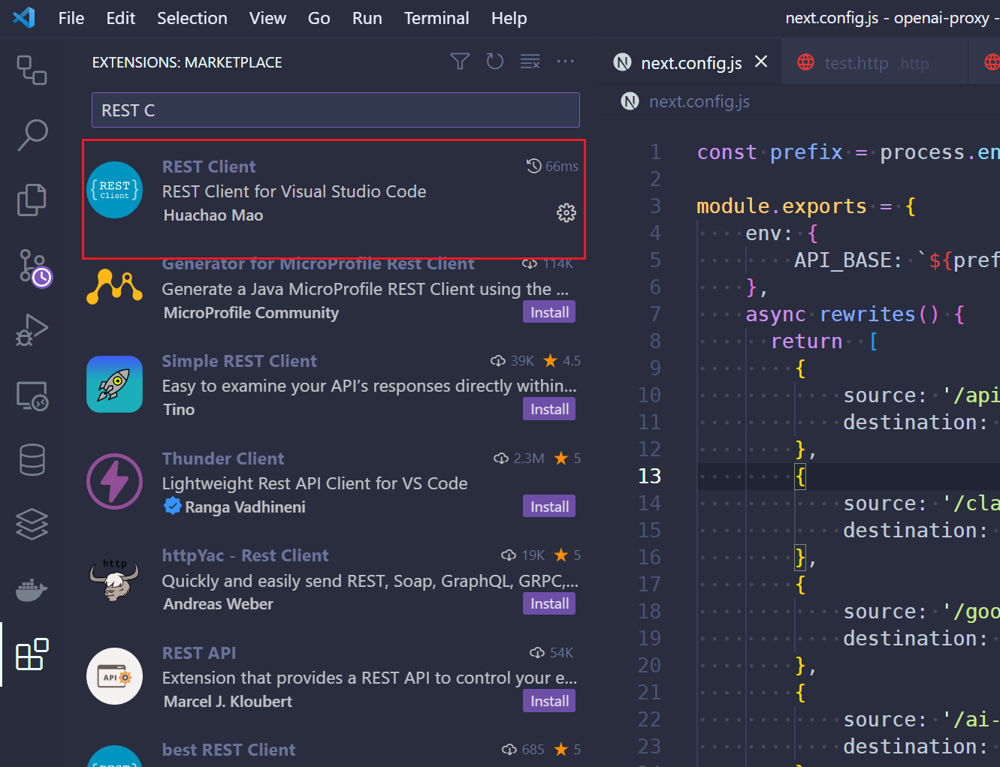

# 前提

第一步：创建账号

访问 [claude](https://claude.ai/) 创建账号

第二步：拿到 orgId

第三步：拿到 SessionKey

session 当前的时效为一个月，简单而言，一个月后，你需要重复这个步骤来获取新的 sessionKey

# 接口

请使用 vscode 查看 [claude.http](./claude.http) 文件，在此之前请确保 vscode 安装  REST Client 插件

