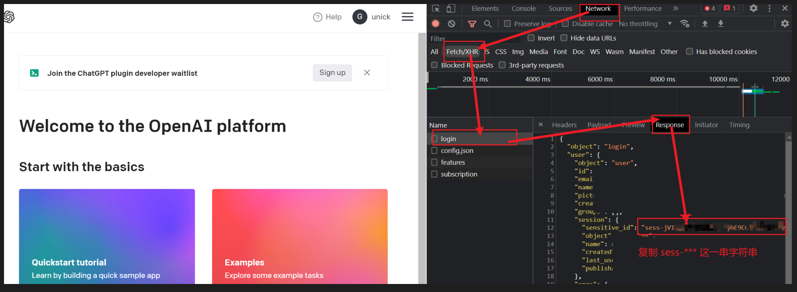
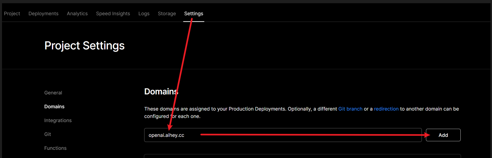

# Hi, there 👋

`openai-proxy` 是为中国用户提供的一个方案，即解决 openai api 无法正常请求。

## ✨ 新特征

### 支持查询消耗量

自从 2023 年 04 月份开始，`https://api.openai.com/dashboard/billing/credit_grants` 无法通过 token (`sk-*****`) 来进行请求。

#### 方式1：使用 `openai-proxy`

缺点：
- 最多只能查询 100 天（结束日期 - 开始日期 <= 100 天）
- 和网页端查看存在一定出入（这个不知道为啥，有了解的小伙伴欢迎在 ISSUE 指出）

```bash
# 指定统计开始日期和结束日期
curl https://openai.aihey.cc/credit_grants?start_date=2023-02-10&end_date=2023-05-10 \
  -H "Content-Type: application/json" \
  -H "Authorization: Bearer $OPENAI_API_KEY"

# 不指定参数，默认统计开始日期为（今天-99 天），统计结束日期为（明天）
curl https://openai.aihey.cc/credit_grants \
  -H "Content-Type: application/json" \
  -H "Authorization: Bearer $OPENAI_API_KEY"
```

#### 方式2：使用网页端生成的 `sensitive_id` 

缺点：
- 首次需要去网页端获取。（F12 后刷新网页） 



```bash
curl https://api.openai.com/dashboard/billing/credit_grants\
  -H "Content-Type: application/json" \
  -H "Authorization: Bearer sess-*****"
```

## 🎉 使用

### 快速使用

你只需要将 `https://api.openai.com/` 替换成 `https://openai.aihey.cc/` 即可。

```bash
# openai api
curl https://api.openai.com/v1/chat/completions \
  -H "Content-Type: application/json" \
  -H "Authorization: Bearer $OPENAI_API_KEY" \
  -d '{
    "model": "gpt-3.5-turbo",
    "messages": [{"role": "user", "content": "Hello!"}]
  }'

# 替换后
curl https://openai.aihey.cc/v1/chat/completions \
  -H "Content-Type: application/json" \
  -H "Authorization: Bearer $OPENAI_API_KEY" \
  -d '{
    "model": "gpt-3.5-turbo",
    "messages": [{"role": "user", "content": "Hello!"}]
  }'
```

### 自行部署

#### step 1: 使用 vercel 部署

[](https://vercel.com/new/clone?demo-title=openai-proxy&repository-name=openai-proxy&repository-url=https://github.com/UNICKCHENG/openai-proxy&from=github)

#### step 4: 自定义域名



#### step 2: 去域名服务商添加 CNAME
```
cname-china.vercel-dns.com 
```

## 💖 感谢
- <https://vercel.com/docs>
- <https://nextjs.org/docs>
- <https://platform.openai.com/docs/api-reference>