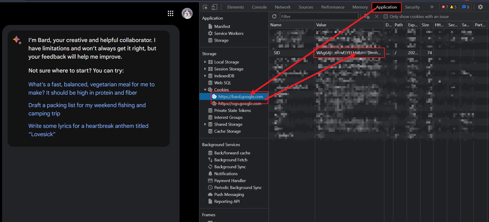

# Hi, there 👋

API 文档请查看 👉 https://openai-proxy.apifox.cn

`openai-proxy` 是为中国用户提供的一个方案，目前可以帮你解决的问题有：

- ✅ OpenAI API 请求超时
- ✅ OpenAI API  不支持查询费用消耗量
- ✅ Claude API 还在等待列表中
- ✅ Google Bard 没有提供 API（目前存在问题，正在修复。。。）
- 。。。

## OpenAI API 请求超时

现在您只需要将 `https://api.openai.com` 替换成 `https://openai.aihey.cc/openai` 即可食用

```bash
# openai api
curl https://api.openai.com/v1/chat/completions \
  -H "Content-Type: application/json" \
  -H "Authorization: Bearer $OPENAI_API_KEY" \
  -d '{
    "model": "gpt-3.5-turbo",
    "messages": [{"role": "user", "content": "Hello!"}]
  }'

# 替换后
curl https://openai.aihey.cc/openai/v1/chat/completions \
  -H "Content-Type: application/json" \
  -H "Authorization: Bearer $OPENAI_API_KEY" \
  -d '{
    "model": "gpt-3.5-turbo",
    "messages": [{"role": "user", "content": "Hello!"}]
  }'
```

## OpenAI API  不支持查询费用消耗量

>  自从 2023 年 04 月份开始，`https://api.openai.com/dashboard/billing/credit_grants` 只能通过网页登录生成的 session id 来请求，而 key (`sk-*****`) 的方式将无效。**不过您可以通过下述两个方式来请求**。

### 方式1：使用 `openai-proxy`

缺点：
- 可能和网页端显示的数据存在差异（这个不知道为啥，有了解的小伙伴欢迎在 [ISSUES](https://github.com/UNICKCHENG/openai-proxy/issues) 指出）

```bash
# 指定统计开始日期和结束日期
curl https://openai.aihey.cc/openai/billing/credit_grants?start_date=2022-05-10&end_date=2023-05-10 \
  -H "Content-Type: application/json" \
  -H "Authorization: Bearer sk-***********"

# 不指定参数，默认统计最近 90 天的数据
curl https://openai.aihey.cc/openai/billing/credit_grants \
  -H "Content-Type: application/json" \
  -H "Authorization: Bearer sk-**********"
```

### 方式2：使用网页端生成的 `sensitive_id` 

缺点：
- 首次需要去网页端获取（按 F12 后刷新网页） 
- 可能随时会失效（但目前来看只要网页端不退出登录，`sensitive_id` 时效都比较长）


```bash
curl https://openai.aihey.cc/openai/billing/credit_grants\
  -H "Content-Type: application/json" \
  -H "Authorization: Bearer sess-*****"
```

## Claude web API 支持

### 开始之前

- 访问 [claude.ai](https://claude.ai/) 创建账号（暂时只有美国和英国 IP 可访问）
- 从网页端拿到 orgId
- 从网页端拿到 sessionKey

> 
> 

### 获取全部会话

```bash
curl -X GET 'http://openai.aihey.cc/claude/organizations/dca2a902-a463-41f0-88cb-b047deb40178/chat_conversations' \
--header 'Accept: */*' \
--header 'Content-Type: application/json'
--header 'Cookie: sessionKey=sk-***********' \
```

### 生成 AI 回复
```bash
curl -X POST 'http://openai.aihey.cc/claude/append_message' \
--header 'Accept: text/event-stream' \
--header 'Cookie: sessionKey=sk-***********' \
--header 'Content-Type: application/json' \
--data-raw '{
  "completion": {
    "prompt": "hello",
    "timezone": "Asia/Shanghai",
    "model": "claude-2"
  },
  "organization_uuid": "dca2a902-a463-41f0-88cb-b047deb40178",
  "conversation_uuid": "5446798e-0e11-4e8f-994c-3d8386f01bd6",
  "text": "hello",
  "attachments": []
}'
```

### 生成 AI 回复（类 OpenAI）

已经支持类似 gpt 的请求格式，如果你使用的第三方插件支持自定义 OpenAI 地址，现在可以直接将 `https://api.openai.com` 替换成 `http://openai.aihey.cc/claude/{organization_uuid}/{conversation_uuid}`

```bash
curl -X POST 'http://openai.aihey.cc/claude/dca2a902-a463-41f0-88cb-b047deb40178/5446798e-0e11-4e8f-994c-3d8386f01bd6/v1/chat/completions' \
--header 'Accept: */*' \
--header 'Content-Type: application/json' \
--data-raw '{
    "model":"gpt-3.5-turbo",
    "messages": [
        {"role": "user", "content":"hello"}
    ],
    "stream": false
}'
```

更多接口请参考 https://openai-proxy.apifox.cn/doc-2721086

### 支持 Google Bard API（非官方）[目前存在问题]

> **承诺：当 Google Bard 官方开放 API 时，将替换为官方 API 请求**

借助 [PawanOsman/GoogleBard](https://github.com/PawanOsman/GoogleBard) 现成的封装，现支持通过 api 请求 Google Bard

```bash
curl https://openai.aihey.cc/google/bard \
  -H "Content-Type: application/json" \
  -H "__Secure-1PSID=**********************"
  -d '{
    "prompt": "hello"
  }'
```

> `__Secure-1PSID` 获取方式如下图，网页端打开 Google Bard 后，F12 查看 Cookies
> 

## 🎉 自行部署

#### step 1: 使用 vercel 部署

[](https://vercel.com/new/clone?demo-title=openai-proxy&repository-name=openai-proxy&repository-url=https://github.com/UNICKCHENG/openai-proxy&from=github)

#### step 4: 自定义域名


#### step 2: 去域名服务商添加 CNAME
```
cname-china.vercel-dns.com 
```


## 👉 一些疑问

### openai api key 会不会被盗用（重点）

**不会，但也不要放下警惕**。市面上也有很多同类**开源**的优秀产品，都不会恶意地盗用使用者的 key，遗憾的是，这并不代表全部。因此，在使用第三方平台的产品，**尽量使用一个定期更新的 key**。

如果有条件的话，建议参考前面内容自行部署，如果遇到问题，可在 Issues 中提问。

### 为什么创建这个项目

因为想入门 [Next.js](https://nextjs.org/docs)，所以就有了这个项目。

另外，这里只是提供一个方案，对于 API 请求速度并没得到多少提升，自行部署还需要额外提供域名，似乎听着就嫌麻烦。

- 如果你是名爱折腾的开发者，或许也可以尝试 Nginx、Cloudflare 等方案
- 如果你希望有个直接拿来用的方案，那么请放心大胆地白嫖


## 💖 感谢

- <https://vercel.com/docs>
- <https://nextjs.org/docs>
- <https://platform.openai.com/docs/api-reference>
- https://github.com/PawanOsman/GoogleBard
- https://github.com/vercel-labs/ai
- https://claude.ai
